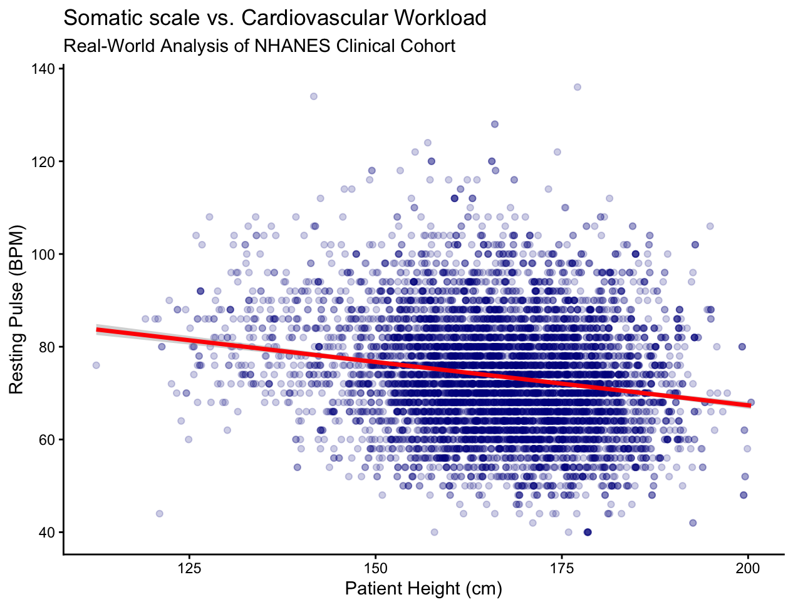

## Allometric Scaling and the Cardiovascular Workload: An In-Depth Analysis of Body Stature-Resting Pulse Correlation Using the NHANES Dataset

## Abstract
This study investigates how human body stature influences baseline cardiovascular mechanics. Using data from the National Health and Nutrition Examination Survey (NHANES), this analysis evaluates the relationship between physical height and resting heart rate across a diverse clinical cohort. The objective is to determine if macro-structural somatic scaling applies consistently to human vital signs.

## Hypothesis
It is hypothesized that there will be a statistically significant negative correlation between a patient's physical height and their resting heart rate. Based on biological scaling laws, individuals with greater height are expected to possess larger cardiac structures and higher stroke volumes. Consequently, their cardiovascular systems should require fewer contractions per minute to maintain systemic perfusion, resulting in a lower resting pulse compared to shorter individuals.

## Methods
Data for this secondary analysis was sourced from the National Health and Nutrition Examination Survey (NHANES) package in RStudio. To ensure data integrity, a data-cleaning pipeline was constructed to manage missing clinical values. Utilizing the `na.omit()` function, any patient observations lacking recorded heights or resting pulse measurements were completely removed. This left a final robust cohort of 8,510 real-world clinical observations for statistical evaluation. Visualizations and linear regression modeling (`method = "lm"`) were executed using the `ggplot2` package to track the exact directional trend of the scaling correlation.

```R
install.packages("NHANES")
library(NHANES)
library(ggplot2)

names(NHANES)

clean_health_data <- na.omit(NHANES[, c("Height", "Pulse", "Age")])

ggplot(data = clean_health_data, aes(x = Height, y = Pulse)) +
  geom_point(color = "darkblue", alpha = 0.2, size = 1.5) +
  geom_smooth(method = "lm", color = "red", linewidth = 1.2) +
  labs(title = "Somatic Scale vs. Cardiovascular Workload",
       subtitle = "Real-World Analysis of NHANES Clinical Cohort",
       x = "Patient Height (cm)",
       y = "Resting Pulse (BPM)") +
  theme_classic()

summary(lm(Pulse ~ Height, data = clean_health_data))
```



## Results
The linear regression analysis of the 8,510 cleaned clinical observations revealed a statistically significant negative correlation between physical height and resting heart rate (p < 2.2e-16). The mathematical model calculated an intercept coefficient of 104.76 BPM and a Height slope coefficient of -0.187. This indicates that for every 1-centimeter increase in patient height, the resting pulse decreases by approximately 0.19 beats per minute. The dense data clustering combined with a highly significant t-value (-17.25) confirms that somatic scaling plays a consistent role in shaping baseline human vitals. 

## Conclusion
This secondary analysis successfully confirms the hypothesis that human stature exhibits a negative allometric scaling relationship with resting heart rate. As an individual grows taller, the physical volume of the cardiac chambers increases, yielding a higher stroke volume per contraction. To maintain standard systemic blood perfusion, a heart with greater stroke volume requires fewer beats per minute, directly lowering the overall resting pulse. This independent study demonstrates the critical intersection of physics, macro-structural anatomy, and clinical diagnostics.


